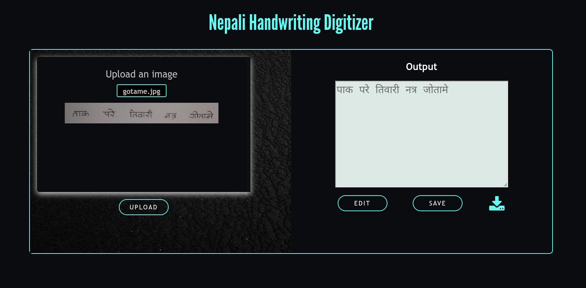

# Nepali OCR

```
The Primary objectives of our project are as follows:
    To recognize Nepali characters and numbers in handwritten documents.
    To convert the handwritten digits into electronic format.
    To develop a user-friendly interface for users to digitize their Nepali handwriting.
```

Some output results are:



Link to our site deployed
[Nepali OCR](https://hamro-ocr.herokuapp.com/)
